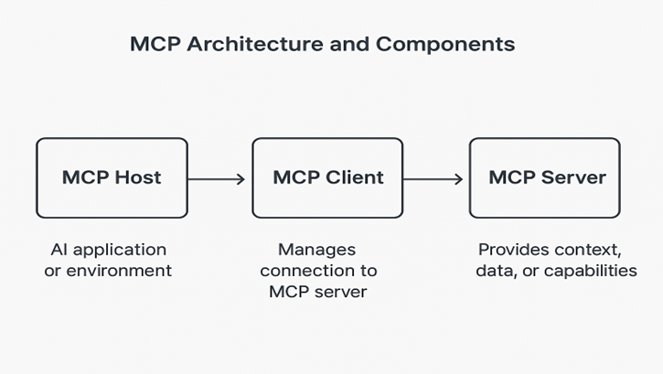

# Defra MCP Guidance

> **Status:** MCP is currently under review. Only designated pilot projects can use MCP until further notice.

Model Context Protocol (MCP) lets an AI Assistant access approved systems such as Jira, GitHub, Confluence, Azure DevOps and SonarQube in a controlled way. This page explains how to use MCP safely within Defra and how it fits with this playbook.

## 1. What is MCP?

MCP is a protocol that enables AI Assistants to securely fetch context from external systems when responding to your requests. An MCP server exposes those capabilities to the Large Language Model (LLM) and can run:

- On your machine (local)
- In the cloud (remote, vendor-hosted)
- In a hybrid model

*Image: MCP architecture showing the Host (AI application), Client (connection manager) and Server (context provider)*

For Defra, **remote vendor-hosted MCP servers are preferred** because they provide:

- Consistent governance and centralised configuration
- Stronger security controls and monitoring
- Built-in audit logging
- Vendor-managed updates and patches

MCP gives AI access to:

- **Code context:** repositories, branches, pull requests, build logs
- **Runtime context:** CI/CD pipelines, telemetry and deployment status
- **Work management:** Jira issues, Azure DevOps work items, Confluence pages
- **Product and user context:** analytics, support tickets

## 2. Why use MCP?

Use MCP when you need an AI Assistant to work with real project data while keeping control of what it can see and do.

Benefits:

- **Improved accuracy:** the AI can see the right tickets, documents and code, so answers are grounded in your project reality.
- **Controlled data sharing:** only approved data sources and scopes are exposed.
- **Reusable integrations:** standard connectors work across teams and services.
- **Reduced complexity:** you avoid one-off scripts and bespoke API wrappers.
- **Faster adoption:** clear patterns and boundaries help teams use AI safely.
- **Trust and transparency:** you can trace where information came from and what tools were used.

## 3. Security and data protection

When you configure MCP, treat tool calls as you would any integration between production systems.

Follow these rules:

- **Never auto-approve MCP actions.** Always review tool calls before they run.
- **Use OAuth-based authentication.** Do not use Personal Access Tokens (PATs).
- **Connect only to vendor-provided MCP servers.** Do not point your AI Assistant at community or self-built MCP servers unless they have gone through Defra approval.
- **Apply organisation-wide consistency.** Use the same approved connectors and patterns across teams.

Practical steps:

- Exclude sensitive, personal or client-confidential data from prompts and MCP context.
- Redact secrets and credentials from any text you send to the AI Assistant.
- Keep secret scanning, dependency scanning and other security tooling active in your CI/CD.
- Gate merges using Defra security tooling such as SonarQube (SAST) and any approved DAST tools.
- Review and test AI-generated code as you would any third-party code.
- Document MCP usage and any known exclusions in your team docs.
- Be transparent with your team and stakeholders about where and how AI is used.

## 4. Key risks and mitigations

- **Prompt injection:** Malicious content in tickets, docs or code attempts to override model rules or leak data.
  - Mitigation: Keep a human in the loop, review tool calls and do not follow instructions that conflict with Defra policies.
- **Tool poisoning:** Manipulated tools or data sources provide misleading outputs.
  - Mitigation: Use only trusted vendor MCP connectors and monitor data quality.
- **Command injection:** Malicious input causes unintended tool calls or actions.
  - Mitigation: Do not auto-approve actions, and restrict tool scopes to the minimum needed.

## 5. Governance and best practices

- Trust only **vendor-provided** MCP servers that have been assessed by Defra.
- Prefer **remote** MCP servers, and verify vendor domains and TLS certificates.
- Pin MCP server versions where possible and maintain a simple change log.
- Use OAuth2 with least-privilege scopes and rotate tokens regularly.
- Restrict access to only the repositories, projects and workspaces needed.
- Follow Defra AI guidelines, this SDLC playbook and Copilot legal guidance:
  - Do not add personal or confidential data to prompts.
  - Do not share credentials or API keys.
  - Record significant AI usage and decisions in your project documentation.

## 6. When to use or avoid MCP

Use MCP when:

- You access approved external work systems via vendor-hosted connectors (for example Jira, Confluence, GitHub, Azure DevOps, SonarQube).
- You need to pull or create issues, read documentation, query metadata or scan repositories as part of a task.
- You use remote MCP servers with OAuth authentication and clearly defined scopes.
- You want to improve context and understanding for the LLM while keeping control over data.

Do **not** use MCP when:

- You want to connect unapproved, community or self-built MCP servers.
- You handle Official-Sensitive, SEC2/SEC3, personal or client-confidential data.
- Your project or programme has not explicitly approved AI tool usage.

Any exception must receive explicit written approval from the relevant Project Architect and the ACE team.

## 7. Embedding MCP in delivery workflows

MCP should support existing delivery practices described in this playbook, not replace them.

- Enable MCP at **enterprise level** for secure access to approved systems.
- Configure your IDE or AI Coding Assistant to use only trusted vendor MCP servers.
- Keep humans in control of tool calls and merging changes.
- Combine MCP with the four pillars in the playbook:
  - Clear requirements
  - Good prompts
  - Rules for AI
  - Capable code generation models

## 8. Approved MCP servers

The following MCP servers are approved for use in Defra. Do not use other MCP servers unless explicitly approved by the ACE team.

**Cloud providers**

- Azure: https://github.com/microsoft/mcp/tree/main/servers/Azure.Mcp.Server
- AWS: https://github.com/awslabs/mcp

**SAST – SonarQube / SonarCloud**

- SonarQube MCP server: https://docs.sonarsource.com/sonarqube-mcp-server

**Repositories / backlogs / pipelines**

- Atlassian / Jira: https://www.atlassian.com/platform/remote-mcp-server
- GitHub: https://github.com/github/github-mcp-server
- Azure DevOps: https://github.com/microsoft/azure-devops-mcp

## 9. Summary checklist

Use this checklist when configuring or reviewing MCP usage:

- Use only vendor-provided, remote MCP servers.
- Authenticate via OAuth with least-privilege scopes.
- Exclude sensitive, personal or client data from prompts and context.
- Keep secret scanning and security tooling enabled.
- Maintain human-in-the-loop approval for tool actions.
- Document MCP usage and material AI assistance in project docs.
- Follow Defra AI, security and legal guidelines.

## Next steps

- Review the [Allowed Tools for Defra Pilot](defra-approved-tools.md).
- Revisit the [Workflow](../getting-started/workflow.md) and [Four Pillars](../getting-started/the-four-pillars.md) to see where MCP can help.
