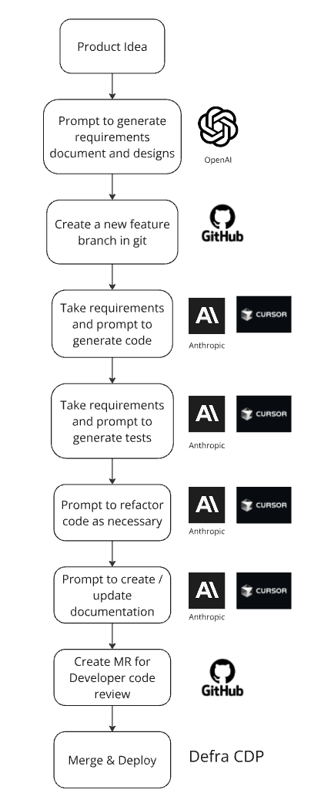

# Workflow

The diagram below shows the main steps in this playbook. We've deliberately simplified it. This development workflow follows recognised best practices already used throughout government, with help from AI tools and techniques.

*Image: Simplified development workflow diagram*

### Key stages of the workflow

**1. User research and problem exploration**
- Conduct user research to understand real user needs and pain points
- Use AI tools to assist with research analysis and pattern identification
- Validate service/product hypotheses against user evidence
- *Ideas for AI Application: Research synthesis of anonymised data, theme identification, insight generation*

**2. Service design, interaction design and content designn**  
- Design user journeys and service blueprints based on research findings
- Create design concepts that address validated user needs
- Use AI to iterate on design solutions and explore alternatives
- Use AI with the prototyping toolkit in an IDE
- *Ideas for AI application: Journey mapping assistance, design concept generation, accessibility checking*

**3. Design validation and testing**
- Test design concepts with real users
- Validate that proposed solutions meet user needs effectively
- Use AI to evaluate and analyse existing content or guidance   
- Refine designs based on user feedback
- *AI Application: Test plan generation, feedback analysis, iteration suggestions*

**4. Product or service definition**
- Define clear product/service scope based on validated user needs
- Ensure technical feasibility aligns with user requirements

**5. AI-Assisted Requirements Generation**
- Generate requirements from validated user needs and design concepts
- Use AI to create user stories and acceptance criteria
- **UCD Professional Review Required**: Validate requirements against original user research

- **Product or service idea** - This represents the problems you need to solve for your users using existing service design and user research techniques
- **Prompt to generate requirements documents and designs** - Use advanced models, such as the latest "thinking" models, to generate requirements documentation (features, user stories, data models) from your clearly defined ideas
- **Create a new feature branch in git** - This workflow uses traditional git branching strategies for code versioning. Git is a simple proven technique that helps you manage AI generated changes
- **Take requirements and prompt to generate code** - Use the requirements from the previous step to prompt the Artificial Intelligence Coding Assistants (AICAs) to generate code
- **Take requirements and prompt to generate tests** - Generate tests from the same product requirements in the Coding Assistant. This makes sure the business logic defined in the requirements are tested independently from the code generation
- **Prompt to refactor as necessary** - You can also prompt additional refactoring of the code at this point
- **Prompt to create or update documentation** - Keep documentation up to date by prompting the Coding Assistant to update documentation based on the changes you've made
- **Create MR for developer code review** - Generate a Merge Request (MR) in git following traditional development practices. Review each line of code for quality and brevity, making sure that the code to be deployed is production-ready
- **Merge and deploy** - Once you merge the MR into the main branch, use automated pipeline processes to deploy the code, as per your normal deployment processes

## [Next -> The Four Pillars](the-four-pillars.md)